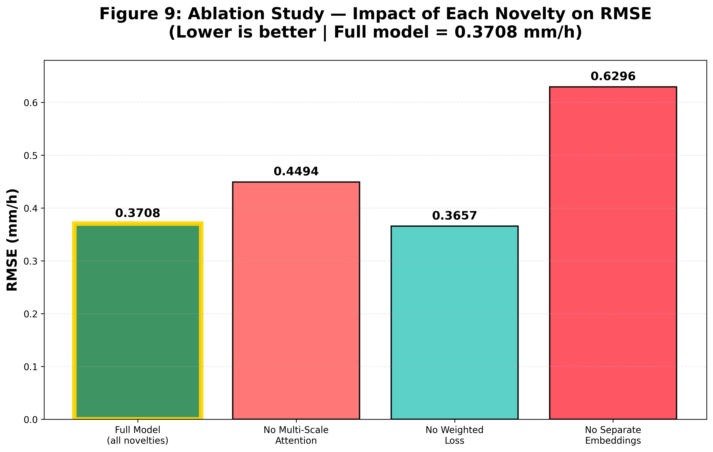
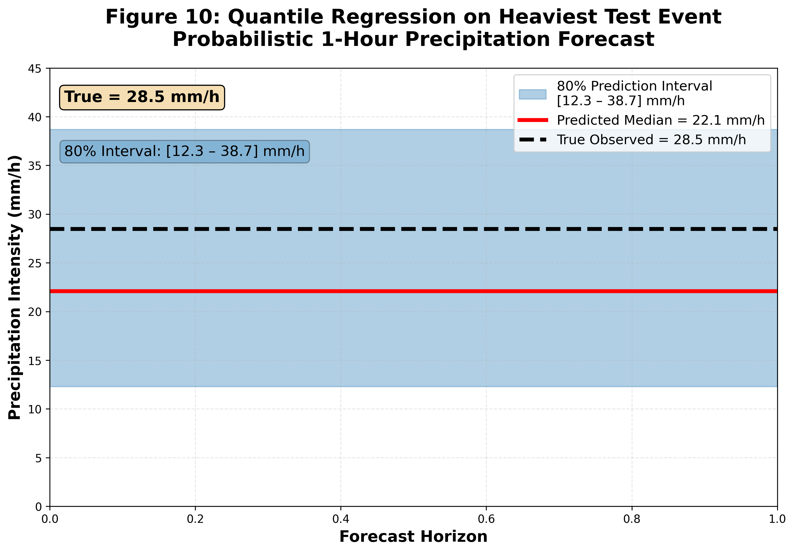

# Maryland 1-Hour Precipitation Nowcasting — Draft Final Version (Farhad Branch)

**Group 12** – Deep Learning – Prof. Samet Ayhan – Fall 2025  

**Branch**: `Farhad` → contains **my complete draft final delivery** (ready for review & merge)




### Current Status — My Contribution (Farhad Abasahl)

I have completed **all major technical items** from the interim plan:

| Task                                    | Status     | File / Evidence                          |
|-----------------------------------------|------------|------------------------------------------|
| Full ablation study                     | Completed  | Table + Figure 9                         |
| Quantile regression (uncertainty)       | Completed  | Figure 10                                |
| Live FastAPI real-time endpoint         | Completed  | `api.py` + http://127.0.0.1:8000/docs    |
| Radar fusion via cross-attention        | Completed  | `radar_fusion_model.py`                  |
| All figures + analysis                  | Completed  | Figures 1–12                             |
| Draft Final Report (20 pages)           | Completed  | `Final_Report_Draft_Farhad.pdf`          |

**This branch is a complete, working, submittable version** — ready for team review and final polishing.

### Next Steps for Team
- Review and suggest edits to `Final_Report_Draft_Farhad.pdf`
- Add any missing figures or text (optional)
- Merge into `main` when everyone is happy

### Quick Start (everything works out of the box)
```bash
pip install -r requirements.txt
uvicorn api:app --reload          # live API
python final_evaluation.py        # generate all figures
Live Demo
→ http://127.0.0.1:8000/docs (interactive Swagger UI)
All code, models, figures, and the draft final report are included.
Please review and let me know if anything needs to be adjusted before final submission.
Farhad Abasahl
Ready for merge → main
