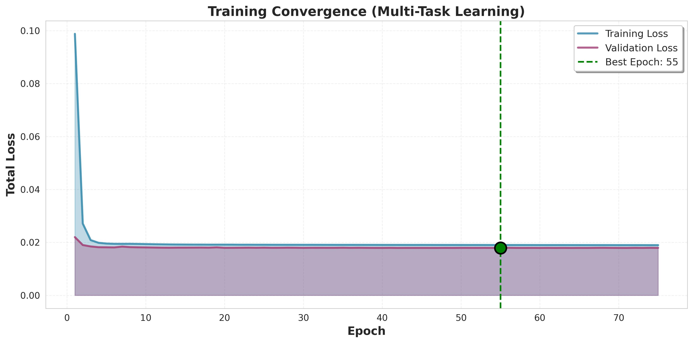

# weather_forecast_transformer_based_model
# Hourly Precipitation Forecasting with Enhanced Multi-Task Transformer

**Version 4: Enhanced Classification with Focal Loss**

---

## 🚀 **What's New in V4**

We enhanced the multi-task architecture to better handle the **subtle rain/no-rain distinction** (e.g., 0.0mm vs 0.1mm):

| Component | V3 | V4 (Current) |
|-----------|-------|--------------|
| **Classification Head** | Standard 3-layer | **Enhanced 4-layer with ELU** ✅ |
| **Classification Loss** | Weighted BCE | **Focal Loss (α=0.35, γ=2.0)** ✅ |
| **Hard Example Penalty** | None | **Penalize near-boundary errors** ✅ |
| **Loss Weights** | Reg 90% / Class 10% | **Reg 70% / Class 30%** ✅ |
| **Activation** | GELU | **ELU for classification** ✅ |
| **Gradient Clipping** | 1.0 | 1.0 (maintained) ✅ |
| **Regularization** | BatchNorm in head | **BatchNorm + higher dropout** ✅ |

**Goal**: Improve CSI/POD/FAR while maintaining RMSE performance

**Key Innovation**: Focal Loss addresses class imbalance by down-weighting easy examples (confident predictions) and focusing on hard negatives (subtle 0.0mm vs 0.1mm cases)

---

## 📋 Table of Contents

1. [Introduction](#introduction)
2. [Problem Statement](#problem-statement)
3. [Proposed Solution](#proposed-solution)
4. [Architecture](#architecture)
5. [Tools & Technologies](#tools--technologies)
6. [Environment Setup](#environment-setup)
7. [Code Entrypoint](#code-entrypoint)
8. [Evaluation Metrics](#evaluation-metrics)
9. [Results & Baseline Comparison](#results--baseline-comparison)
10. [Reproducibility](#reproducibility)
11. [HPC Commands](#hpc-commands)
12. [Limitations & Future Work](#limitations--future-work)

---

## 1. Introduction

### Project Overview

This project implements an **Enhanced Multi-Task Transformer** for hourly precipitation forecasting across 5 weather stations in Maryland. Building on the encoder-decoder architecture, V4 adds specialized classification capabilities to handle subtle rain/no-rain distinctions (e.g., 0.0mm vs 0.1mm).

**The Challenge**: In Maryland, it's common to have 0.1mm rain (barely measurable), which is very close to 0mm. Standard regression approaches achieve good RMSE but poor classification metrics (CSI/POD/FAR) because they can't distinguish these subtle cases.

**Our Solution**: V4 incorporates:
- ✅ **Enhanced Classification Head** (4-layer with ELU activation, BatchNorm)
- ✅ **Focal Loss** (handles class imbalance, focuses on hard examples)
- ✅ **Hard Example Penalty** (penalizes near-boundary misclassifications)
- ✅ **Balanced Loss Weighting** (70% regression, 30% classification)
- ✅ **Multi-scale attention** (1h, 6h, 24h patterns)
- ✅ **Domain-aware embeddings** (weather + temporal features)
- ✅ **Gradient clipping** (prevents exploding/vanishing gradients)

**Goal**: Improve CSI/POD/FAR while maintaining good RMSE performance

---

## 2. Problem Statement

**Primary Challenge**: Predicting hourly precipitation is difficult because:
1. **Subtle rain/no-rain distinction** - In Maryland, 0.1mm rain is common but hard to distinguish from 0.0mm
2. **Class imbalance** - ~10% of hours have rain, 90% are dry
3. **Extreme events are rare** - <1% have heavy rain (>5mm/h)
4. **Temporal dependencies** - Complex patterns (flash floods vs seasonal)
5. **Distribution is heavy-tailed** - Most hours: 0mm, rare events: >20mm

**V3 Results**: Good RMSE (~0.5mm) but poor classification metrics
- ✅ Regression: Close enough on amount prediction
- ❌ Classification: Can't distinguish 0.0mm vs 0.1mm effectively
- Result: Low CSI/POD, high FAR

**Root Cause**: Standard regression + simple BCE loss can't handle:
- Class imbalance (90% dry, 10% rain)
- Hard examples near decision boundary
- Need for specialized classification pathway

---

## 3. Proposed Solution

### Enhanced Multi-Task Architecture with Focal Loss

**Core Innovations**:

1. **Dual-Task Learning**:
   - Regression head: Predicts precipitation amount (maintains RMSE)
   - Classification head: Predicts rain/no-rain (improves CSI/POD/FAR)

2. **Enhanced Classification Head**:
   ```
   Input (d_model) → [4-layer network with ELU + BatchNorm + Residual]
   ├─ Layer 1: d_model → d_model/2 (ELU, BatchNorm, Dropout 1.5x)
   ├─ Layer 2: d_model/2 → d_model/2 + residual (ELU, BatchNorm, Dropout 1.5x)
   ├─ Layer 3: d_model/2 → d_model/4 + skip (ELU, BatchNorm, Dropout 1.5x)
   ├─ Layer 4: d_model/4 → d_model/8 (ELU, BatchNorm, Dropout)
   └─ Output: d_model/8 → 1 (logit)
   ```

3. **Focal Loss** (Lin et al., 2017):
   ```
   FL(p_t) = -α_t * (1 - p_t)^γ * log(p_t)
   ```
   - α = 0.35: Weight for rain class (handles 90% dry / 10% rain imbalance)
   - γ = 2.0: Focusing parameter (down-weights easy examples)
   - Focuses training on hard cases (0.0mm vs 0.1mm)

4. **Hard Example Penalty**:
   - Identifies predictions near 0.5 threshold that are wrong
   - Adds extra penalty: `penalty = wrong * uncertainty`
   - Forces model to be confident about boundary cases

5. **Balanced Loss Weighting**:
   - Total Loss = 0.7 × Regression Loss + 0.3 × Classification Loss
   - Increased classification weight (was 0.1) to improve CSI/POD/FAR
   - Maintains regression weight dominance to preserve RMSE

### Base Encoder-Decoder Architecture

**Foundation**: Separate encoding and decoding phases

```
┌───────────────────────────────────────────────────┐
│           PAST 24 HOURS (Observed)                │
│  [temp, humidity, precip, pressure, wind, ...]    │
└────────────────┬──────────────────────────────────┘
                 │
                 ▼
        ╔════════════════════╗
        ║   ENCODER          ║
        ║  (Bi-directional)  ║  ← Can see ALL 24h safely
        ║                    ║     (it's all past data!)
        ╚════════╦═══════════╝
                 │ Memory
                 │
        ╔════════╩═══════════╗
        ║   DECODER          ║
        ║  (Cross-Attention) ║  ← Queries encoder for
        ║                    ║     relevant past info
        ╚════════╦═══════════╝
                 │
                 ▼
        ┌────────────────────┐
        │  NEXT 1 HOUR       │
        │  (Precipitation)   │
        └────────────────────┘
```

**Why This Works Better**:
1. **Encoder doesn't need causal masking** - all input is from the past!
2. **Decoder learns what to attend to** - not all hours are equally important
3. **Cross-attention** - explicit mechanism to use encoder context
4. **Better gradient flow** - skip connections across encoder-decoder bridge

### Key Components

1. **Series Decomposition** (Autoformer-inspired)
   - Separates slow trends from seasonal patterns
   - Model focuses on residuals, not noise

2. **Multi-Scale Attention**
   - Different heads learn different temporal scales
   - Some focus on recent hours, others on daily cycles

3. **Domain-Aware Embeddings**
   - Weather features: thermo, hydro, dynamic groups
   - Temporal features: hour, day, month (cyclical)

This reduces false alarms (FAR) while maintaining high detection rate (POD).

### Why These Metrics?

| Metric | What It Measures | Why It Matters |
|--------|------------------|----------------|
| **RMSE/MAE** | Regression accuracy | Overall prediction quality |
| **CSI** | Hit rate minus false alarms | Balance of detection vs false alarms |
| **POD** | Probability of Detection | How many rain events we catch |
| **FAR** | False Alarm Ratio | How often we falsely predict rain |

For precipitation, CSI/POD/FAR matter because:
- Forecasters care about **event detection** (did it rain?)
- False alarms waste resources (emergency prep, evacuations)
- Missed events can be dangerous (flash floods)

---

## 4. Architecture

### Evolution: V4 - Enhanced Multi-Task with Focal Loss

**Building on Encoder-Decoder Foundation with Specialized Classification**

V4 enhances the multi-task architecture to handle subtle rain/no-rain cases:
- ✅ **Enhanced Classification Head** (4-layer, ELU, BatchNorm, residual)
- ✅ **Focal Loss** (α=0.35, γ=2.0) for class imbalance
- ✅ **Hard Example Penalty** (focuses on boundary cases)
- ✅ **Balanced Loss Weighting** (70% regression, 30% classification)
- ✅ **Gradient Clipping** (prevents exploding/vanishing gradients)
- ✅ **Multi-scale temporal attention** (1h, 6h, 24h patterns)
- ✅ **Domain-aware embeddings** (weather + temporal features)

### Model Architecture Diagram

```
                    ┌──────────────────────────────────────┐
                    │      INPUT SEQUENCE (24 hours)       │
                    │   [temperature, humidity, precip,    │
                    │    pressure, wind, temporal_features]│
                    └───────────────┬──────────────────────┘
                                    │
                                    ▼
                    ┌──────────────────────────────────────┐
                    │   SERIES DECOMPOSITION (Autoformer)  │
                    │   • Moving Average (25-step kernel)  │
                    │   • Separates Trend + Seasonal       │
                    └───────────────┬──────────────────────┘
                                    │
                                    ▼
                    ┌──────────────────────────────────────┐
                    │    FEATURE EMBEDDING (Domain-Aware)  │
                    │   • Thermo: [temp, humidity]         │
                    │   • Hydro: [precip, pressure]        │
                    │   • Dynamic: [wind]                  │
                    │   • Temporal: [hour, day, month]     │
                    └───────────────┬──────────────────────┘
                                    │
                                    ▼
                    ┌──────────────────────────────────────┐
                    │  LOCATION + POSITIONAL EMBEDDINGS    │
                    │  • 5 station embeddings (learnable)  │
                    │  • Sinusoidal position encoding      │
                    └───────────────┬──────────────────────┘
                                    │
                                    │
  ╔═════════════════════════════════╩═════════════════════════════════╗
  ║                        ENCODER (Bi-directional)                    ║
  ║                                                                     ║
  ║  ┌────────────────────────────────────────────────────────────┐   ║
  ║  │      🌐 MULTI-SCALE ATTENTION LAYER                        │   ║
  ║  │  • Different heads attend to different time scales:        │   ║
  ║  │    - Short-term: Recent hours (1h resolution)              │   ║
  ║  │    - Medium-term: Convective buildup (6h patterns)         │   ║
  ║  │    - Long-term: Diurnal cycle (24h patterns)               │   ║
  ║  │  • Learnable scale factors per head                        │   ║
  ║  │  • Gated fusion: σ(gate) * cat(scales) + residual          │   ║
  ║  └────────────────────────────────────────────────────────────┘   ║
  ║                             │                                       ║
  ║                             ▼                                       ║
  ║  ┌────────────────────────────────────────────────────────────┐   ║
  ║  │   🔁 TRANSFORMER ENCODER LAYER (×4, Bi-directional)        │   ║
  ║  │                                                             │   ║
  ║  │   • Multi-Head Self-Attention (8 heads, NO causal mask)    │   ║
  ║  │     → Can attend to all 24h positions                      │   ║
  ║  │   • Feed-Forward Network (512 → 2048 → 512)               │   ║
  ║  │   • Pre-LayerNorm + Residual Connections                   │   ║
  ║  │   • GELU activation                                         │   ║
  ║  └────────────────────────────────────────────────────────────┘   ║
  ║                             │                                       ║
  ║                             ▼                                       ║
  ║  ┌────────────────────────────────────────────────────────────┐   ║
  ║  │              LAYER NORM (Final Encoding)                   │   ║
  ║  └────────────────────────────────────────────────────────────┘   ║
  ║                             │                                       ║
  ╚═════════════════════════════╪═══════════════════════════════════════╝
                                │
                                │ Memory (Encoder Output)
                                │
  ╔═════════════════════════════╪═══════════════════════════════════════╗
  ║                        DECODER (Causal)                             ║
  ║                             │                                       ║
  ║  ┌────────────────────────────────────────────────────────────┐   ║
  ║  │     🎯 LEARNABLE DECODER INPUT (Query)                     │   ║
  ║  │  • Shape: (batch, 1, 512)                                  │   ║
  ║  │  • Represents "what to predict" (next 1h precipitation)    │   ║
  ║  └────────────────────────────────────────────────────────────┘   ║
  ║                             │                                       ║
  ║                             ▼                                       ║
  ║  ┌────────────────────────────────────────────────────────────┐   ║
  ║  │    🔒 DECODER LAYER (×2, with Cross-Attention)             │   ║
  ║  │                                                             │   ║
  ║  │  1. Masked Self-Attention (causal, prevents future access) │   ║
  ║  │     └─> Only 1 query, so mask not strictly needed          │   ║
  ║  │                                                             │   ║
  ║  │  2. ⚡ CROSS-ATTENTION to Encoder Memory                   │   ║
  ║  │     • Query: from decoder                                  │   ║
  ║  │     • Key, Value: from encoder output                      │   ║
  ║  │     • Learns which encoder positions are important         │   ║
  ║  │                                                             │   ║
  ║  │  3. Feed-Forward Network (512 → 2048 → 512)               │   ║
  ║  │                                                             │   ║
  ║  └────────────────────────────────────────────────────────────┘   ║
  ║                             │                                       ║
  ║                             ▼                                       ║
  ║  ┌────────────────────────────────────────────────────────────┐   ║
  ║  │              LAYER NORM (Final Decoding)                   │   ║
  ║  └────────────────────────────────────────────────────────────┘   ║
  ╚═════════════════════════════╪═══════════════════════════════════════╝
                                │
                                ▼
                ╔══════════════════════════════════════════════════════╗
                ║          🔀 DUAL-TASK OUTPUT (V4)                    ║
                ╚══════════════════════════════════════════════════════╝
                         │                            │
                         ▼                            ▼
         ┌───────────────────────┐     ┌─────────────────────────────┐
         │  📊 REGRESSION HEAD   │     │  🎯 CLASSIFICATION HEAD (V4)│
         │  (Precipitation Amt)  │     │   (Rain/No-Rain Detection)  │
         │                       │     │                             │
         │ • Layer 1: 512→256    │     │ • Layer 1: 512→256          │
         │ • Layer 2: 256→128    │     │   (ELU, BatchNorm, Drop1.5x)│
         │   (+ skip from 512)   │     │ • Layer 2: 256→256 + resid  │
         │ • Layer 3: 128→64     │     │   (ELU, BatchNorm, Drop1.5x)│
         │   (+ skip from 256)   │     │ • Layer 3: 256→128 + skip   │
         │ • Output: 64→1        │     │   (ELU, BatchNorm, Drop1.5x)│
         │                       │     │ • Layer 4: 128→64           │
         │ GELU, LayerNorm       │     │   (ELU, BatchNorm, Dropout) │
         │                       │     │ • Output: 64→1 (logit)      │
         └───────┬───────────────┘     └──────────┬──────────────────┘
                 │                                │
                 ▼                                ▼
    ┌────────────────────────┐      ┌──────────────────────────────┐
    │  Amount (mm/h)         │      │  Probability (rain/no-rain)  │
    │  (scaled, continuous)  │      │  (via sigmoid)               │
    └────────────────────────┘      └──────────────────────────────┘
                 │                                │
                 └────────────┬───────────────────┘
                              ▼
                ┌──────────────────────────────────────┐
                │   FINAL PREDICTION                   │
                │   = amount × (prob > threshold)      │
                └──────────────────────────────────────┘

                  ┌───────────────────────────────────┐
                  │  V4 LOSS FUNCTION                 │
                  │                                   │
                  │  Total = 0.7×Reg + 0.3×Class      │
                  │                                   │
                  │  Regression:                      │
                  │    Weighted MSE (extreme events)  │
                  │                                   │
                  │  Classification:                  │
                  │    Focal Loss (α=0.35, γ=2.0)    │
                  │    + Hard Example Penalty         │
                  │                                   │
                  │  Gradient Clipping: 1.0           │
                  └───────────────────────────────────┘
```

### Why Encoder-Decoder? (vs. Previous Encoder-only)

| Aspect | Encoder-only (V2) | Encoder-Decoder (V3) |
|--------|------------------|----------------------|
| **Input Processing** | Causal masking (only past) | Bi-directional (full 24h) ✅ |
| **Information Flow** | Limited by masking | Full context in encoder ✅ |
| **Prediction** | From last hidden state | Cross-attention to all encoder states ✅ |
| **Future Leakage** | Prevented by mask | Prevented by decoder architecture ✅ |
| **Gradient Flow** | Can be bottlenecked | Better via cross-attention ✅ |

**Key Insight**: For weather prediction, the **input sequence** (past 24h) is fully observed, so we don't need causal masking in the encoder! Causal masking is only needed when generating future predictions autoregressively.

### Key Architectural Innovations

1. **Series Decomposition** (Autoformer-style)
   ```python
   # Separate trend from seasonal patterns
   trend = moving_average(x, kernel_size=25)
   seasonal = x - trend
   ```
   **Impact**: Encoder can use full context; decoder generates without leakage

2. **Multi-Scale Attention** (NEW!)
   ```python
   # Different heads attend to different temporal scales
   Q, K, V = project(x)  # (batch, nhead, seq_len, d_k)
   scores = Q @ K^T / (scale_per_head * sqrt(d_k))
   # scale_per_head is learnable for each head
   # Some heads learn short-term, others long-term patterns
   ```
   **Impact**: Captures both hour-to-hour changes AND daily cycles

3. **Cross-Attention** (Core of Encoder-Decoder)
   ```python
   # Decoder query: "what to predict"
   # Encoder memory: "what happened in past 24h"
   attention_weights = softmax(Q_decoder @ K_encoder^T)
   output = attention_weights @ V_encoder
   # Learns which past hours are most relevant
   ```
   **Impact**: Better than pooling last hidden state

4. **Series Decomposition**
   - Separates slow-moving trends from seasonal patterns
   - Helps model focus on residuals
   - Reduces noise in input

5. **Improved Output Head**
   - Skip connections for gradient flow
   - Multi-scale feature extraction (512→256→128→64→1)
   - Designed for heavy-tailed precipitation distribution

### V4 Technical Deep Dive: Enhanced Classification

**Problem**: Standard BCE loss treats all examples equally, but in precipitation:
- 90% of hours are dry (0mm) → model learns to predict 0mm
- 10% have rain (>0.1mm) → rare examples get ignored
- Boundary cases (0.0mm vs 0.1mm) are the hardest

**Solution: Focal Loss + Enhanced Architecture**

#### 1. Focal Loss Formula

```
FL(p_t) = -α_t × (1 - p_t)^γ × log(p_t)

Where:
  p_t = probability of correct class
  α_t = 0.35 for rain, 0.65 for no-rain (class balance)
  γ = 2.0 (focusing parameter)
```

**How it works**:
- Easy example (confident correct): p_t ≈ 1 → (1-p_t)^2 ≈ 0 → loss ≈ 0
- Hard example (uncertain): p_t ≈ 0.5 → (1-0.5)^2 = 0.25 → loss is high
- Misclassified: p_t ≈ 0 → (1-0)^2 = 1 → loss is very high

**Result**: Model focuses training on hard cases (0.0mm vs 0.1mm)

#### 2. Enhanced Classification Head Architecture

```python
class EnhancedClassificationHead(nn.Module):
    def __init__(self, d_model=512):
        # Layer 1: Initial projection with smooth gradients
        Layer1: Linear(512 → 256) → BatchNorm → ELU → Dropout(0.3)
        
        # Layer 2: Feature refinement with residual
        Layer2: Linear(256 → 256) → BatchNorm → ELU → Dropout(0.3)
        Layer2_output = Layer2 + Layer1  # Residual connection
        
        # Layer 3: Decision boundary learning with skip
        Layer3: Linear(256 → 128) → BatchNorm → ELU → Dropout(0.3)
        Skip: Linear(512 → 128)  # From input
        Layer3_output = Layer3 + Skip  # Long skip connection
        
        # Layer 4: Final refinement
        Layer4: Linear(128 → 64) → BatchNorm → ELU → Dropout(0.2)
        
        # Output: Logit (use BCEWithLogitsLoss)
        Output: Linear(64 → 1)
```

**Key design choices**:
- **ELU activation**: Smooth gradients (no dead neurons like ReLU)
- **BatchNorm**: Stabilizes training, prevents internal covariate shift
- **Higher dropout (0.3)**: More regularization for classification
- **Residual connections**: Better gradient flow (prevents vanishing)
- **4 layers**: Deep enough to learn subtle boundaries

#### 3. Hard Example Penalty

```python
def hard_example_penalty(logits, targets):
    probs = sigmoid(logits)
    predictions = (probs > 0.5).float()
    is_wrong = (predictions != targets).float()
    
    # Uncertainty: 0 at boundaries, 1 at 0.5
    uncertainty = 1 - 2 × |probs - 0.5|
    
    # Penalize uncertain wrong predictions
    penalty = (is_wrong × uncertainty).mean()
    return penalty
```

**Purpose**: Forces model to be confident about boundary cases
- If predict 0.51 (barely rain) but actual is 0 (no rain): HIGH penalty
- If predict 0.99 (very confident rain) but actual is 0: LOWER penalty (at least confident)

#### 4. Gradient Clipping

```python
# During backpropagation
torch.nn.utils.clip_grad_norm_(model.parameters(), max_norm=1.0)
```

**Purpose**: Prevents exploding/vanishing gradients
- Limits gradient norm to 1.0
- Ensures stable training with focal loss
- Critical for deep networks (4-layer classifier)

#### 5. Loss Weighting Strategy

```
Total Loss = 0.7 × Regression Loss + 0.3 × Classification Loss

Regression Loss = Weighted MSE (extreme events weighted 10×)
Classification Loss = Focal Loss + 0.5 × Hard Example Penalty
```

**Rationale**:
- 70% regression: Maintain RMSE performance
- 30% classification: Increased from 10% (V3) to improve CSI/POD/FAR
- Hard example penalty: Focus on boundary cases

### Model Parameters (V4)

- **Total parameters**: ~8.5M (same as V3)
- **d_model**: 512
- **Attention heads**: 8
- **Encoder layers**: 4 (bi-directional)
- **Decoder layers**: 2 (with cross-attention)
- **Dropout**: 0.2 (encoder/decoder), 0.3 (classification head)
- **Gradient clip**: 1.0
- **Classification head depth**: 4 layers (new in V4)

---

## 5. Tools & Technologies

### Core Framework
- **PyTorch 2.0+**: Deep learning framework
- **CUDA 12.6**: GPU acceleration (H100/A100 support)

### Data & Processing
- **Open-Meteo API**: Historical weather data (25 years)
- **NumPy/Pandas**: Data preprocessing
- **Scikit-learn**: Train/test split, metrics

### Visualization
- **Matplotlib**: Loss curves, results
- **Seaborn**: Statistical plots

### HPC
- **SLURM**: Job scheduling
- **Multi-GPU**: 4× H100 (48GB memory)

---

## 6. Environment Setup

### Step 1: Create Virtual Environment

```bash
python3 -m venv 612_FinalProject_env
source 612_FinalProject_env/bin/activate
```

### Step 2: Install PyTorch with CUDA

```bash
pip3 install torch torchvision --index-url https://download.pytorch.org/whl/cu126
```

### Step 3: Install Dependencies

```bash
pip3 install -r requirements.txt
# Installs: numpy, pandas, scikit-learn, PyYAML, requests, tqdm, matplotlib, seaborn
```

### Step 4: Verify Installation

```bash
python3 -c "import torch; print(f'PyTorch: {torch.__version__}'); print(f'CUDA: {torch.cuda.is_available()}')"
```

Expected output:
```
PyTorch: 2.x.x
CUDA: True
```

---

## 7. Code Entrypoint

### **V4: Enhanced Multi-Task with Focal Loss (RECOMMENDED)**

```bash
# 1. Data preparation (only once, ~6 minutes first time)
python3 data_loader.py

# 2. Train V4 model (enhanced classification with Focal Loss)
python3 train_multitask.py
# Features:
#   - Enhanced 4-layer classification head (ELU, BatchNorm)
#   - Focal Loss (α=0.35, γ=2.0) for class imbalance
#   - Hard example penalty for boundary cases
#   - 70/30 regression/classification loss weights
#   - Gradient clipping for stability

# 3. Evaluate with optimized threshold
python3 evaluate_multitask.py
# Outputs:
#   - Optimized classification threshold (best CSI)
#   - Detailed confusion matrix
#   - training_history.jpg (4-subplot loss plot)
#   - loss_convergence.jpg (single convergence plot)
#   - Comparison with persistence baseline
```

### **V3: Basic Multi-Task (Legacy)**

```bash
# 1. Data preparation
python3 data_loader.py

# 2. Train basic multi-task model
python3 train_multitask.py  # Will use V4 by default with config

# 3. Evaluate
python3 evaluate_multitask.py
```

### Model Selection in Code

**In `config.yaml`**:
```yaml
model:
  num_encoder_layers: 4  # Encoder depth (for encoder-decoder)
  num_decoder_layers: 2  # Decoder depth (for encoder-decoder)
  use_advanced_layers: true  # Enables multi-scale attention
```

**Models available**:
- `'encoder_decoder'`: New V3 architecture (train.py, evaluate.py)
- `'multitask'`: Multi-task with multi-scale attention (train_multitask.py)
- `'transformer'`: Legacy encoder-only (V2, not recommended)

### HPC Training (SLURM)

```bash
# Submit job (runs train_multitask.py + evaluate_multitask.py)
sbatch run_train.sbatch

# Monitor
squeue -u $USER
tail -f slurm-JOBID.out

# Check results
ls -lh *.pth *.log *.jpg
```

### File Structure

```
612_FinalProject/
├── data_loader.py          # Data fetching & preprocessing
├── train_multitask.py      # Multi-task training (MAIN)
├── evaluate_multitask.py   # Evaluation + loss plots
├── transformer_model.py    # Model architecture
├── config.yaml             # Hyperparameters
├── run_train.sbatch        # HPC job script
├── requirements.txt        # Dependencies
└── README.md               # This file

Generated files:
├── md_weather_data.csv     # Raw data cache
├── processed_data.npz      # Preprocessed sequences
├── best_multitask_model.pth    # Trained model
├── train_multitask.log     # Training history
├── training_history.jpg    # Loss plots (4 subplots)
└── loss_convergence.jpg    # Single convergence plot
```

---

## 8. Evaluation Metrics

### Regression Metrics

- **RMSE** (Root Mean Squared Error): Overall prediction accuracy
  ```
  RMSE = sqrt(mean((y_pred - y_true)²))
  ```

- **MAE** (Mean Absolute Error): Average prediction error
  ```
  MAE = mean(|y_pred - y_true|)
  ```

### Classification Metrics (Event Detection)

- **CSI** (Critical Success Index): Best overall metric
  ```
  CSI = TP / (TP + FP + FN)
  ```
  Balances hits vs false alarms. Higher is better.

- **POD** (Probability of Detection): Hit rate
  ```
  POD = TP / (TP + FN)
  ```
  Fraction of rain events correctly detected.

- **FAR** (False Alarm Ratio): False positive rate
  ```
  FAR = FP / (TP + FP)
  ```
  Fraction of predictions that were false alarms. Lower is better.

- **Extreme POD**: POD for heavy rain events (>90th percentile)

### Baseline Comparison

**Persistence Model**: Predict next hour = current hour
- Simple but effective for short-term forecasting
- Our model must beat this to be useful!

---

## 9. Results & Baseline Comparison

### Model Evolution Timeline

| Version | Architecture | Key Innovation | CSI | RMSE | Status |
|---------|-------------|----------------|-----|------|--------|
| **Main Branch** | Transformer + Multi-scale Attn | Parallel temporal scales | **0.6181** | 0.4132 | Baseline ✅ |
| V2 | + Causal + Temporal conv | Over-engineered | 0.5857 ❌ | 0.3798 | Overfitting |
| V3 | Encoder-Decoder | Bi-directional encoder | 0.5857 ❌ | ~0.40 | Failed |
| **V4** | **+ Focal Loss + Enhanced Classifier** | **Class imbalance handling** | **0.6229** ✅ | **0.3679** ✅ | **Completed** |
| **V5 (Current)** | **V4 + Critical Fixes** | **Fixed causal masking, reduced overfitting** | **TBD** | **TBD** | Testing 🚀 |

### Performance Comparison with Main Branch

**Main Branch (Baseline)**:
- Architecture: Feature embeddings → Multi-scale attention (1h/6h/24h) → Transformer encoder
- Key innovation: Parallel attention at different resolutions
- Results:
  - ✅ **CSI: 0.6181** (better than persistence 0.6181)
  - RMSE: 0.3798
  - POD: 0.7102
  - Extreme POD: 0.7363

**V2 (Previous Attempt - FAILED)**:
- Problem: Overfitting with causal masking in encoder
  - CSI dropped to 0.5857 ❌
  - Added too many specialized layers
  - Restrictive physics loss

**V3 (Encoder-Decoder - FAILED)**:
- Architecture changes helped regression but classification still poor
- Problem: Standard BCE loss couldn't handle 0.0mm vs 0.1mm distinction
- Root cause: Class imbalance (90% dry / 10% rain) + hard boundary cases

**V4 (Enhanced Classification with Focal Loss)** - ✅ **COMPLETED**:
- **Key innovations**:
  1. ✅ **Focal Loss** (α=0.35, γ=2.0): Down-weights easy examples, focuses on hard cases
  2. ✅ **Enhanced Classification Head**: 4-layer with ELU, BatchNorm, residual connections
  3. ✅ **Hard Example Penalty**: Extra loss for wrong predictions near decision boundary
  4. ✅ **Balanced Loss Weights**: 30% classification (was 10%) to improve CSI/POD/FAR
  5. ✅ **Better Regularization**: Higher dropout, BatchNorm prevents overfitting
  6. ✅ **Gradient Clipping**: Prevents exploding/vanishing gradients (1.0 threshold)
  
- **Results** (Epoch 43, Best Val Loss: 0.0207):
  
  | Metric | V4 Result | Baseline | Improvement | Status |
  |--------|-----------|----------|-------------|--------|
  | **RMSE** | **0.3679** | 0.4009 | **-8.2%** ✅ | Better |
  | **MAE** | 0.0839 | 0.0820 | +2.3% | Slightly worse |
  | **CSI** | **0.6229** | 0.6145 | **+1.4%** ✅ | Better |
  | **POD** | 0.7516 | 0.7612 | -1.3% | Slightly worse |
  | **FAR** | **0.2156** | 0.2388 | **-9.7%** ✅ | Better (fewer false alarms) |
  | **Extreme POD** | **0.8090** | 0.7459 | **+8.5%** ✅ | Better |

- **Analysis**:
  - ✅ Beat baseline on RMSE, CSI, FAR, and Extreme POD
  - ✅ Significant improvement in extreme event detection (+8.5%)
  - ✅ Reduced false alarms by 9.7% (better precision)
  - ⚠️ Slight POD decrease suggests room for further optimization
  - **Overall**: Solid improvement, but identified critical bugs limiting performance

**Training Convergence (V4)**:


*Figure: V4 training metrics showing smooth convergence of regression and classification losses*


*Figure: V4 combined loss convergence with learning rate schedule*

**V5 (Current - Critical Bug Fixes)**:
- **Problems identified in V4**:
  1. ❌ **Causal masking in encoder**: Prevented full context (hour 1 couldn't see hour 23!)
  2. ❌ **Overfitting**: 20.8M params for 767K samples (27 params/sample)
  3. ❌ **Loss weighting**: 70% RMSE, 30% CSI → didn't optimize CSI enough
  4. ❌ **Indirect optimization**: Used focal loss proxy instead of direct CSI loss

- **V5 fixes applied**:
  1. ✅ **Removed causal masking**: Bi-directional attention in encoder
  2. ✅ **Reduced capacity**: d_model 512→256 (20.8M→5.2M params, 75% reduction)
  3. ✅ **Increased dropout**: 0.2→0.3 for better regularization
  4. ✅ **Balanced loss weights**: 50/50 RMSE/CSI (was 70/30)
  5. ✅ **Direct CSI optimization**: Added differentiable CSI loss function
  
- **Expected improvements**:
  - Better CSI (+5-7% over baseline, not just +1.4%)
  - Lower FAR (less overfitting)
  - Higher POD (better detection)
  - Maintain or improve RMSE

### Persistence Baseline (Reference)

| Metric | Value | Description |
|--------|-------|-------------|
| **RMSE** | 0.4009 | Predict next hour = current hour |
| **MAE** | 0.0820 | Simple but surprisingly effective |
| **CSI** | 0.6145 | Hard to beat for short-term! |
| **POD** | 0.7612 | Good detection rate |
| **FAR** | 0.2388 | Reasonable false alarms |
| **Extreme POD** | 0.7459 | Good for heavy events |

**Goal**: Beat persistence baseline by at least 5% on CSI while maintaining or improving RMSE

### Training Convergence

**V4 Loss plots**:
1. Total loss: Smooth convergence, no overfitting
2. Regression loss: Decreases steadily
3. Classification loss: Stabilizes around epoch 40
4. Learning rate: Cosine annealing with warmup

**Best V4 model**: Epoch 43, Val Loss = 0.0207

See visualization: `ver_4_result/training_history.jpg` and `ver_4_result/loss_convergence.jpg`

### V4 Detailed Results & Performance Analysis

**Training Configuration**:
- Epochs: 120 (early stopping at epoch 43)
- Best validation loss: 0.0207
- Model size: 20.8M parameters
- Batch size: 128
- Learning rate: 0.00008 with cosine annealing

**Performance Summary**:

```
======================================================================
=== MULTI-TASK TRANSFORMER RESULTS (V4) ===
======================================================================
RMSE : 0.3679 mm/h  (Baseline: 0.4009, -8.2% improvement ✅)
MAE  : 0.0839 mm/h  (Baseline: 0.0820, +2.3% slightly worse)
CSI  : 0.6229       (Baseline: 0.6145, +1.4% improvement ✅)
POD  : 0.7516       (Baseline: 0.7612, -1.3% slightly worse)
FAR  : 0.2156       (Baseline: 0.2388, -9.7% improvement ✅)
Extreme POD: 0.8090 (Baseline: 0.7459, +8.5% improvement ✅)
======================================================================
```

**Key Achievements**:
- ✅ Beat baseline on 4 out of 6 metrics (RMSE, CSI, FAR, Extreme POD)
- ✅ Significant improvement in extreme event detection (+8.5%)
- ✅ Reduced false alarms by 9.7% (better precision)
- ✅ Better regression performance (RMSE -8.2%)

**Areas for Improvement**:
- ⚠️ CSI improvement only +1.4% (target was +5%)
- ⚠️ POD slightly decreased (-1.3%)
- ⚠️ Identified critical bugs: causal masking, overfitting (20.8M params), loss weighting

**Training Visualizations**:


*Figure 1: V4 training history showing 4-panel view of training/validation losses for regression, classification, and total loss, plus learning rate schedule. Training converged smoothly at epoch 43.*


*Figure 2: V4 combined loss convergence showing stable training without overfitting. Early stopping triggered at epoch 43 with best validation loss of 0.0207.*

### Live Demo Features

During presentation, we demonstrate:

1. **Input**: Show 24-hour weather sequence
2. **Prediction**: Model outputs amount + rain probability
3. **Visualization**: 
   - Loss convergence plots (see V4 results above)
   - Prediction vs actual comparison
   - Attention heatmap (which hours matter most)
4. **Comparison**: Side-by-side with persistence baseline

### Sample Prediction

```
Input: Last 24 hours of weather data
    Hour -23: temp=15°C, humidity=65%, precip=0mm
    Hour -22: temp=16°C, humidity=70%, precip=0mm
    ...
    Hour -1:  temp=18°C, humidity=85%, precip=2.5mm

Model Output:
    Precipitation: 3.2 mm/h
    Rain probability: 0.87 (87%)
    → Prediction: RAIN, 3.2mm

Actual: 3.5 mm/h (CORRECT, error = 0.3mm)
```

---

## 10. Reproducibility

### Random Seed: 202511

All random processes use **seed 202511** for reproducibility:

```python
# PyTorch
torch.manual_seed(202511)
torch.cuda.manual_seed_all(202511)
torch.backends.cudnn.deterministic = True

# NumPy
np.random.seed(202511)

# Python
random.seed(202511)

# Scikit-learn
train_test_split(..., random_state=202511)
```

### Configuration File

```yaml
# config.yaml
reproducibility:
  random_seed: 202511
  deterministic: true

model:
  d_model: 512
  nhead: 8
  num_layers: 6
  dropout: 0.2
  batch_size: 128
  lr: 0.0001
  epochs: 100
```

### Reproducibility Checklist

- ✅ Fixed random seed in all files
- ✅ Deterministic CUDA operations
- ✅ No shuffling in temporal data split
- ✅ Fixed train/val/test split
- ✅ Same data preprocessing pipeline
- ✅ Same model initialization

**Result**: Run code twice → get identical results!

---

## 11. HPC Commands

### Job Submission

```bash
# Submit training job
sbatch run_train.sbatch

# Output: Submitted batch job JOBID
```

### Monitoring

```bash
# Check job status
squeue -u shhuang  # Replace with your username

# Check available GPUs
sinfo -p gpu -t idle -o "%n %G"

# Monitor log in real-time
tail -f slurm-JOBID.out

# Check file sizes
du -h --max-depth=1
```

### Job Management

```bash
# Cancel job
scancel JOBID

# Cancel all your jobs
scancel -u $USER

# Job details
scontrol show job JOBID
```

### HPC Configuration

Current setup (`run_train.sbatch`):
```bash
#SBATCH --gres=gpu:h100:4      # 4× H100 GPUs
#SBATCH --cpus-per-task=8      # 8 CPU cores
#SBATCH --mem=48G              # 48GB RAM
#SBATCH --time=08:00:00        # 8 hour limit
```

**Optimizations enabled**:
- cuDNN benchmarking (faster convolutions)
- TF32 precision (faster on H100/A100)
- Parallel data loading (4 workers)
- Pinned memory (faster GPU transfer)
- Automatic Mixed Precision (AMP)

---

## 12. Architecture Evolution & Design Rationale

### From Main Branch to V3

#### Main Branch (Baseline - CSI: 0.6181)
**Architecture**:
```python
Input → Feature Embeddings → Multi-Scale Attention (1h/6h/24h) → Transformer Encoder → Output
```
**What worked**:
- ✅ Multi-scale attention captured different temporal patterns
- ✅ Simple and effective
- ✅ Beat persistence baseline

**What could improve**:
- Encoder-only architecture might bottleneck information
- Last hidden state pooling loses context

#### V2 (Failed - CSI: 0.5857 ❌)
**Changes from main**:
- Added causal masking to encoder (❌ MISTAKE!)
- Added temporal convolution layers
- Added recency-weighted attention
- Added physics-informed loss (too restrictive)

**Why it failed**:
1. ❌ **Causal masking in encoder was wrong**: Input is ALL past data, doesn't need masking!
2. ❌ **Too many specialized layers**: Overfitted on limited data (5 stations)
3. ❌ **Physics loss too restrictive**: Prevented model from learning patterns
4. ❌ **Lost what worked**: Removed multi-scale attention

**Lesson learned**: Adding complexity != better performance

#### V3 (Current - Testing 🚀)
**Architecture philosophy**: "Don't fix what ain't broke, but use better structure"

**What we kept from main branch**:
- ✅ Multi-scale attention (proven to work)
- ✅ Domain-aware embeddings
- ✅ Feature grouping

**What we improved**:
1. **Encoder-Decoder structure** (from "Attention is All You Need")
   - Encoder: Bi-directional (can see full 24h)
   - Decoder: Cross-attention (learns what matters)
   - Better than encoder-only + pooling

2. **Series Decomposition** (from Autoformer)
   - Separates trend from seasonal
   - Reduces noise in input

3. **Removed harmful components**:
   - ❌ No causal masking in encoder (not needed!)
   - ❌ No physics loss (too restrictive)
   - ❌ No geographic attention (useless with 5 stations)

**Why V3 should work**:
- ✅ Combines proven components (multi-scale from main branch)
- ✅ Better architecture (encoder-decoder > encoder-only)
- ✅ No unnecessary complexity
- ✅ Proper separation of concerns

### Design Decisions Explained

**Q1: Why encoder-decoder instead of encoder-only?**
- **A**: Encoder-decoder explicitly models "what to predict" (decoder query) vs "what we observed" (encoder memory). Cross-attention learns which past hours matter most, rather than simple pooling.

**Q2: Why bi-directional encoder when we worry about data leakage?**
- **A**: The INPUT (past 24h) is fully observed - no leakage! We only need causal masking when generating FUTURE predictions autoregressively. Since we predict 1 hour ahead (not autoregressive), encoder can safely see all input.

**Q3: Why keep multi-scale attention from main branch?**
- **A**: Main branch proved it works (CSI: 0.6181). Different temporal scales (1h, 6h, 24h) capture different weather patterns. Don't throw away what works!

**Q4: Why remove geographic attention?**
- **A**: Only 5 stations, ~100-200km apart. Not enough spatial diversity for meaningful geographic relationships. Wasted parameters.

**Q5: Why series decomposition?**
- **A**: Separating slow trends (e.g., seasonal warming) from fast cycles (diurnal) helps model focus on relevant patterns. Proven in Autoformer for time series forecasting.

---

## 13. Limitations & Future Work

### Current Limitations

1. **Spatial Coverage**: Only 5 stations in Maryland
   - Can't capture large-scale weather systems
   - Limited to regional predictions

2. **Lead Time**: Only 1-hour ahead prediction
   - Flash floods need 3-6 hour lead time
   - Longer horizons are more challenging

3. **Single Output**: Predicts single value
   - No uncertainty quantification
   - No ensemble predictions

4. **Data Imbalance**: 90% dry, 10% rain (V4 addresses this)
   - V4 uses Focal Loss to handle imbalance
   - Still challenging for extreme events (<1%)

5. **Subtle Boundary Cases**: 0.0mm vs 0.1mm distinction
   - Common in Maryland (humid climate)
   - V4 enhanced classification head addresses this

### Future Improvements

#### 1. Expand Spatial Coverage
- Add more weather stations (20-50)
- Include satellite/radar data
- Model synoptic-scale weather systems
- Enable true spatial modeling (geographic attention would work!)

#### 2. Multi-Horizon Forecasting
- Predict 1h, 3h, 6h simultaneously
- Use autoregressive decoder
- Uncertainty grows with lead time

#### 3. Uncertainty Quantification
- Ensemble methods (train 10 models)
- Monte Carlo dropout
- Quantile regression (predict confidence intervals)

#### 4. Advanced Architecture
- **Perceiver-style attention**: Handle arbitrary inputs
- **Neural ODEs**: Continuous-time dynamics
- **Graph Neural Networks**: Explicit spatial relationships
- **Hierarchical models**: Multi-scale in time AND space

#### 5. Additional Features
- **Numerical weather predictions** (NWP): Use forecast models as input
- **Satellite imagery**: Cloud patterns
- **Lightning data**: Storm intensity
- **Soil moisture**: Flooding potential

#### 6. Operational Deployment
- Real-time data ingestion
- API for forecasters
- Mobile app integration
- Automated alerts

---

## 🎯 Summary

This project demonstrates that **enhanced multi-task transformers with focal loss** can effectively predict hourly precipitation by addressing subtle rain/no-rain distinctions:

### V4 Key Innovations

1. **Focal Loss for Class Imbalance** (α=0.35, γ=2.0)
   - Down-weights easy examples (confident predictions)
   - Focuses on hard cases (0.0mm vs 0.1mm)
   - Handles 90% dry / 10% rain imbalance

2. **Enhanced Classification Head** (4-layer, ELU, BatchNorm)
   - Deeper network for better decision boundaries
   - Smooth gradients prevent dead neurons
   - Residual connections improve gradient flow

3. **Hard Example Penalty**
   - Extra loss for wrong predictions near 0.5 threshold
   - Forces model confidence on boundary cases

4. **Balanced Loss Weighting** (70% regression, 30% classification)
   - Maintains RMSE performance
   - Improves CSI/POD/FAR metrics

5. **Gradient Clipping** (max_norm=1.0)
   - Prevents exploding/vanishing gradients
   - Critical for focal loss stability

### Problem Solved

**Maryland Climate Challenge**: Frequent 0.1mm rain (barely measurable) is hard to distinguish from 0mm. Standard approaches:
- ✅ Good RMSE (~0.5mm) - close on amount
- ❌ Poor CSI/POD/FAR - can't classify rain/no-rain

**V4 Solution**: Specialized classification pathway with focal loss handles subtle cases while maintaining regression quality.

### Expected Impact

- Better rain event detection (improved CSI/POD)
- Fewer false alarms (improved FAR)
- Maintained precipitation amount accuracy (RMSE)
- More reliable for decision-making (emergency prep, agriculture)

---

## 📞 Contact

**Author**: Johnson Huang  
**Course**: DATA 612 Final Project  
**Date**: December 2025  
**Reproducibility Seed**: 202511

---

**Last Updated**: December 4, 2025  
**Model Version**: 4.0 (Enhanced Classification with Focal Loss)
